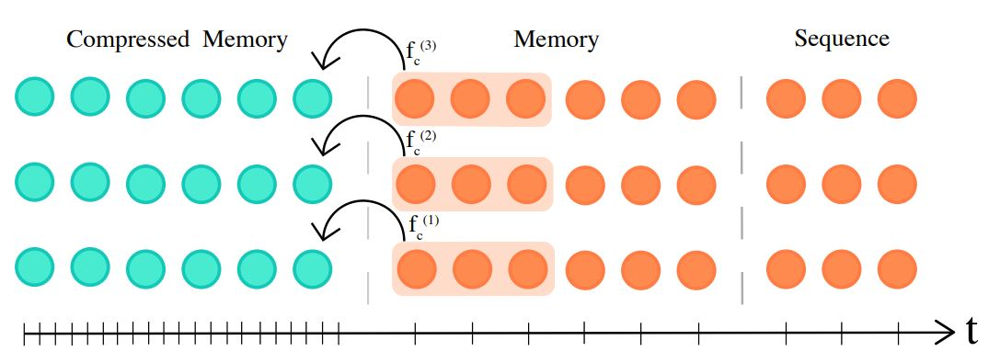

# NLP-Compressive-Transformer

This repository contains my implementation of the [Compressive Transformer](https://arxiv.org/abs/1911.05507), with a general architecture given by


Fig. 1: Compressive Transformer Model as provided in the [Compressive Transformer](https://arxiv.org/abs/1911.05507) paper.

To train the model using the [Reddit Jokes](https://github.com/taivop/joke-dataset) dataset, run
```
python process_reddit_jokes_subwords.py
python train_reddit_jokes_subword_tf_ver2_gpt_compressive.py
```
and 
```
python infer_reddit_jokes_subword_tf_ver2_gpt_compressive.py
```
to perform inference.
